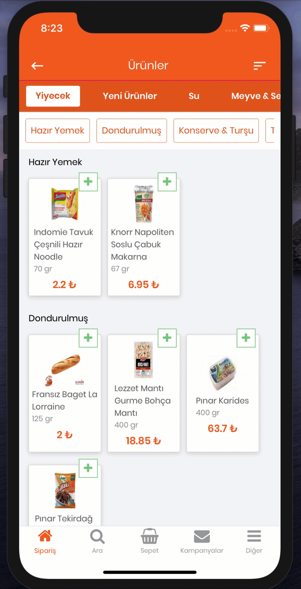
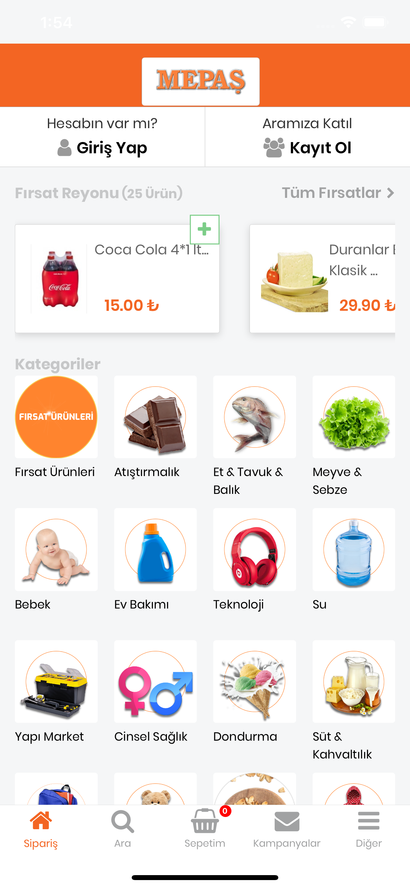
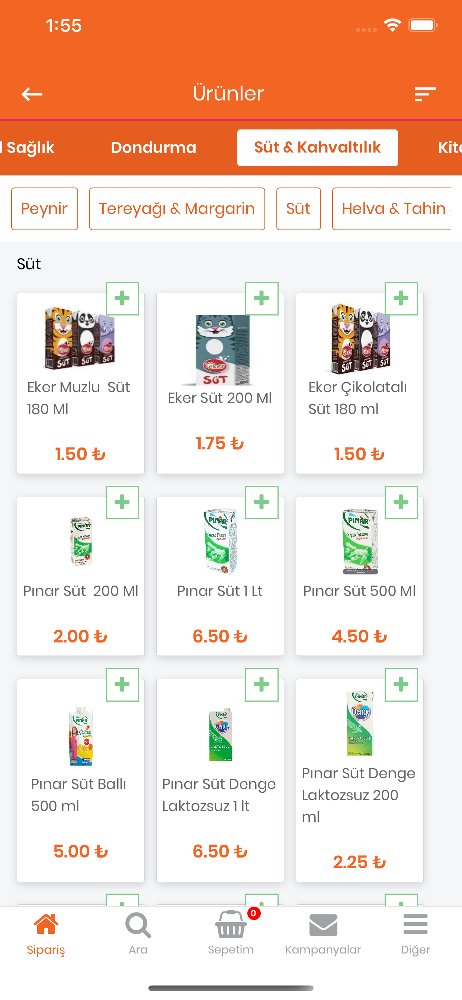

# 🛒 Mepas Market Grocery & Fast Delivery App

This project is a comprehensive mobile application that offers an end-to-end grocery shopping experience, featuring an integrated payment system and live courier tracking.

## 🎥 App Preview (Demo)

Check out the general workflow and animations of the application below:

  

## 📱 Screenshots

Detailed interface designs of the application:

| **Home Screen** | **Product Showcase** |
|:---:|:---:|
|  |  |

## ✨ Key Features

This application is not just a UI; it includes advanced features suitable for real-world scenarios:

* 💳 **Integrated Payment System:** Users can securely save their credit cards and pay the cart amount instantly within the app (3D Secure / Wallet infrastructure).
* 🛵 **Live Courier Tracking:** Once an order is placed, the courier's location can be tracked instantly on the map. Estimated Time of Arrival (ETA) updates dynamically.
* 📦 **Dynamic Cart Management:** Easy product addition, removal, and real-time stock control.
* 🔔 **Notification System:** Instant notifications for order status changes (Preparing, On the Way, Delivered).
* 📱 **Responsive Design:** Optimized layout compatible with different screen sizes.

## 🛠 Tech Stack

Libraries and services used in the project infrastructure:

* **Core:** React Native
* **Maps & Location:** [Google Maps API / Apple Maps]
* **Payment Infrastructure:** PayTR
* **State Management:** Redux
* **Navigation:** React Navigation
* **Icon Set:** Vector Icons
